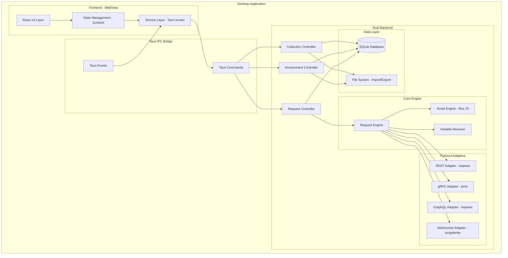
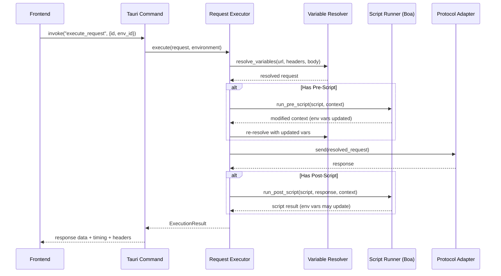
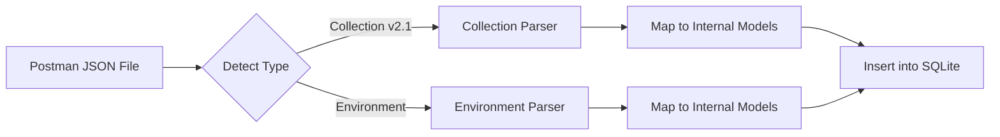

# Pulse API — Cross-Platform API Testing Application

> A local-first, high-performance Postman alternative built with **Rust + Tauri v2**

---

## 1. Executive Summary

Build a desktop API testing tool supporting **REST, gRPC, GraphQL, and WebSocket** protocols. The app runs fully offline, stores data locally via SQLite, supports Postman collection/environment import, and includes a scripting engine for pre/post-request scripts.

---

## 2. Technology Stack

| Layer | Technology | Rationale |
|-------|-----------|-----------|
| **Desktop Shell** | Tauri v2 | Lightweight, cross-platform (macOS/Win/Linux), native webview |
| **Backend** | Rust (Tokio async runtime) | Memory safety, performance, concurrency |
| **Frontend** | React + TypeScript + Vite | Large ecosystem, rich component libraries for complex UIs |
| **Styling** | CSS Modules + custom design system | Full control, no heavy framework overhead |
| **Database** | SQLite via `rusqlite` | Zero-config, embedded, relational queries for collections |
| **Settings** | `tauri-plugin-store` | Simple key-value for app preferences |
| **HTTP Client** | `reqwest` | Mature, async, TLS support |
| **gRPC** | `tonic` + `prost` | De facto Rust gRPC stack |
| **GraphQL** | `reqwest` + manual JSON | Flexible — no schema compilation needed at runtime |
| **WebSocket** | `tokio-tungstenite` | Async WebSocket with Tokio integration |
| **Scripting** | `boa_engine` (JS engine in Rust) | Lightweight JS execution for pre/post scripts |
| **Serialization** | `serde` + `serde_json` | Standard Rust serialization |

---

## 3. High-Level Architecture



---

## 4. Low-Level Architecture

### 4.1 Project Structure

```
pulse-api/
├── src-tauri/
│   ├── Cargo.toml
│   ├── tauri.conf.json
│   ├── capabilities/
│   │   └── default.json
│   ├── src/
│   │   ├── lib.rs                 # Tauri app entry
│   │   ├── main.rs                # Desktop entry
│   │   ├── commands/              # Tauri IPC commands
│   │   │   ├── mod.rs
│   │   │   ├── collection.rs
│   │   │   ├── environment.rs
│   │   │   ├── request.rs
│   │   │   └── import_export.rs
│   │   ├── models/                # Data models
│   │   │   ├── mod.rs
│   │   │   ├── collection.rs
│   │   │   ├── environment.rs
│   │   │   ├── request.rs
│   │   │   └── response.rs
│   │   ├── engine/                # Core execution engine
│   │   │   ├── mod.rs
│   │   │   ├── executor.rs        # Request orchestration
│   │   │   ├── variable_resolver.rs
│   │   │   └── script_runner.rs   # Boa JS engine
│   │   ├── adapters/              # Protocol adapters
│   │   │   ├── mod.rs
│   │   │   ├── rest.rs
│   │   │   ├── grpc.rs
│   │   │   ├── graphql.rs
│   │   │   └── websocket.rs
│   │   ├── db/                    # Database layer
│   │   │   ├── mod.rs
│   │   │   ├── migrations.rs
│   │   │   └── repository.rs
│   │   └── import/                # Postman import
│   │       ├── mod.rs
│   │       ├── collection_parser.rs
│   │       └── environment_parser.rs
│   └── migrations/
│       └── 001_initial.sql
├── src/                           # Frontend (React)
│   ├── main.tsx
│   ├── App.tsx
│   ├── components/
│   │   ├── layout/
│   │   │   ├── Sidebar.tsx
│   │   │   ├── TabBar.tsx
│   │   │   └── StatusBar.tsx
│   │   ├── collections/
│   │   │   ├── CollectionTree.tsx
│   │   │   └── FolderNode.tsx
│   │   ├── request/
│   │   │   ├── RequestPanel.tsx
│   │   │   ├── RequestConfig.tsx   # URL, method, headers, body
│   │   │   ├── BodyEditor.tsx
│   │   │   ├── HeaderEditor.tsx
│   │   │   ├── ParamEditor.tsx
│   │   │   └── ScriptEditor.tsx
│   │   ├── response/
│   │   │   ├── ResponsePanel.tsx
│   │   │   ├── ResponseBody.tsx
│   │   │   └── ResponseHeaders.tsx
│   │   ├── environment/
│   │   │   ├── EnvSelector.tsx
│   │   │   └── EnvEditor.tsx
│   │   └── grpc/
│   │       ├── ProtoUploader.tsx
│   │       └── GrpcMethodSelector.tsx
│   ├── services/                  # Tauri IPC wrappers
│   │   ├── collectionService.ts
│   │   ├── requestService.ts
│   │   └── environmentService.ts
│   ├── stores/                    # Zustand stores
│   │   ├── collectionStore.ts
│   │   ├── requestStore.ts
│   │   ├── environmentStore.ts
│   │   └── tabStore.ts
│   ├── hooks/
│   ├── types/
│   └── styles/
├── package.json
└── vite.config.ts
```

### 4.2 Data Models (Rust)

```rust
// === Collection & Folder ===
struct Collection {
    id: Uuid,
    name: String,
    description: Option<String>,
    created_at: DateTime<Utc>,
    updated_at: DateTime<Utc>,
}

struct Folder {
    id: Uuid,
    collection_id: Uuid,
    parent_folder_id: Option<Uuid>,  // nested folders
    name: String,
    sort_order: i32,
}

// === API Request ===
struct ApiRequest {
    id: Uuid,
    folder_id: Option<Uuid>,
    collection_id: Uuid,
    name: String,
    protocol: Protocol,           // REST | GRPC | GRAPHQL | WEBSOCKET
    method: HttpMethod,           // GET, POST, PUT, DELETE, PATCH, etc.
    url: String,                  // May contain {{variables}}
    headers: Vec<KeyValuePair>,
    query_params: Vec<KeyValuePair>,
    body: Option<RequestBody>,
    pre_script: Option<String>,   // JavaScript
    post_script: Option<String>,  // JavaScript
    sort_order: i32,
    // gRPC-specific
    proto_file: Option<String>,
    grpc_service: Option<String>,
    grpc_method: Option<String>,
}

enum RequestBody {
    None,
    Json(String),
    FormData(Vec<KeyValuePair>),
    FormUrlEncoded(Vec<KeyValuePair>),
    Raw { content: String, content_type: String },
    Binary(Vec<u8>),
    GraphQL { query: String, variables: Option<String> },
}

// === Environment ===
struct Environment {
    id: Uuid,
    name: String,
    variables: Vec<EnvVariable>,
    created_at: DateTime<Utc>,
}

struct EnvVariable {
    key: String,
    value: String,
    var_type: VarType,  // Default | Secret
    enabled: bool,
}
```

### 4.3 Database Schema (SQLite)

```sql
CREATE TABLE collections (
    id TEXT PRIMARY KEY,
    name TEXT NOT NULL,
    description TEXT,
    created_at TEXT NOT NULL DEFAULT (datetime('now')),
    updated_at TEXT NOT NULL DEFAULT (datetime('now'))
);

CREATE TABLE folders (
    id TEXT PRIMARY KEY,
    collection_id TEXT NOT NULL REFERENCES collections(id) ON DELETE CASCADE,
    parent_folder_id TEXT REFERENCES folders(id) ON DELETE CASCADE,
    name TEXT NOT NULL,
    sort_order INTEGER DEFAULT 0
);

CREATE TABLE requests (
    id TEXT PRIMARY KEY,
    folder_id TEXT REFERENCES folders(id) ON DELETE CASCADE,
    collection_id TEXT NOT NULL REFERENCES collections(id) ON DELETE CASCADE,
    name TEXT NOT NULL,
    protocol TEXT NOT NULL DEFAULT 'REST',
    method TEXT NOT NULL DEFAULT 'GET',
    url TEXT NOT NULL DEFAULT '',
    headers TEXT DEFAULT '[]',           -- JSON array
    query_params TEXT DEFAULT '[]',      -- JSON array
    body_type TEXT,
    body_content TEXT,
    pre_script TEXT,
    post_script TEXT,
    sort_order INTEGER DEFAULT 0,
    proto_file TEXT,
    grpc_service TEXT,
    grpc_method TEXT,
    created_at TEXT NOT NULL DEFAULT (datetime('now')),
    updated_at TEXT NOT NULL DEFAULT (datetime('now'))
);

CREATE TABLE environments (
    id TEXT PRIMARY KEY,
    name TEXT NOT NULL,
    created_at TEXT NOT NULL DEFAULT (datetime('now')),
    updated_at TEXT NOT NULL DEFAULT (datetime('now'))
);

CREATE TABLE env_variables (
    id TEXT PRIMARY KEY,
    environment_id TEXT NOT NULL REFERENCES environments(id) ON DELETE CASCADE,
    key TEXT NOT NULL,
    value TEXT NOT NULL DEFAULT '',
    var_type TEXT NOT NULL DEFAULT 'default',
    enabled INTEGER NOT NULL DEFAULT 1
);

CREATE TABLE request_history (
    id TEXT PRIMARY KEY,
    request_id TEXT REFERENCES requests(id) ON DELETE SET NULL,
    url TEXT NOT NULL,
    method TEXT NOT NULL,
    status_code INTEGER,
    response_time_ms INTEGER,
    response_size_bytes INTEGER,
    created_at TEXT NOT NULL DEFAULT (datetime('now'))
);
```

### 4.4 Request Execution Flow



### 4.5 Script Engine API (exposed to user JS)

The Boa JS engine exposes a `pm` global object mimicking Postman's API:

```javascript
// Available in pre-request and post-response scripts
pm.environment.set("accessToken", jsonData.token);
pm.environment.get("baseUrl");
pm.variables.set("tempVar", "value");
pm.response.json();           // post-script only
pm.response.code;             // post-script only
pm.response.headers;          // post-script only
console.log("Debug output");
```

### 4.6 Postman Import Architecture



**Postman Collection v2.1 mapping:**
- `collection.info` → `Collection`
- `collection.item[]` → Recursive `Folder` / `ApiRequest`
- `item.request` → `ApiRequest` (method, url, headers, body)
- `item.event[type=prerequest]` → `pre_script`
- `item.event[type=test]` → `post_script`

---

## 5. User Review Required

> [!IMPORTANT]
> **Frontend Framework Choice**: I recommend **React + TypeScript** for the rich ecosystem (Monaco editor for code/script editing, tree components for collections). Alternative: **Svelte** for smaller bundle size but fewer ready-made components. Please confirm your preference.

> [!IMPORTANT]
> **Scripting Engine**: I recommend **Boa** (pure Rust JS engine) for the `pm.*` scripting API. This allows users to write JavaScript in pre/post scripts like Postman. Alternative: **Rhai** (Rust-native syntax, not JS-compatible). Boa means users familiar with Postman scripts can reuse their knowledge.

> [!WARNING]
> **gRPC Proto File Handling**: gRPC requires `.proto` files to define services. We have two approaches:
> 1. **Server Reflection** — query the gRPC server for its schema at runtime (simpler UX, but server must support it)
> 2. **Proto Upload** — user uploads `.proto` files which we parse with `prost-reflect` (works with any server)
> I recommend supporting **both**, starting with proto upload in Sprint 3.

## 6. Open Questions

1. **App Name**: I used "Pulse API" as a working title. Do you have a preferred name?
2. **Export Format**: Should we also support exporting collections back to Postman format, or only import?
3. **Auth Helpers**: Should we build dedicated auth UI panels (OAuth2 flow, Bearer token, Basic auth, API Key) like Postman has, or keep it manual via headers/scripts?
4. **Code Generation**: Should the app generate code snippets (cURL, Python, JS, etc.) from requests?
5. **Theme**: Dark mode only, light mode only, or both with toggle?

---

## 7. Sprint Plan (2-week sprints)

### Sprint 1 — Foundation & Project Scaffolding *(Week 1-2)* - **[DONE]**

| Task | Details | Status |
|------|---------|--------|
| Init Tauri v2 + React + Vite project | `npx create-tauri-app` | ✅ Done |
| Design system & layout shell | Sidebar, tab bar, main panel, status bar | ✅ Done |
| SQLite integration + migrations | `rusqlite`, initial schema | ✅ Done |
| Collection CRUD | Create, rename, delete collections | ✅ Done |
| Folder CRUD | Nested folders within collections | ✅ Done |
| Collection tree UI | Drag-drop reordering, context menus | ✅ Done |

**Deliverable**: App shell with collection/folder management, no request execution yet. - **[COMPLETED]**

---

### Sprint 2 — REST API Client *(Week 3-4)* - **[DONE]**

| Task | Details | Status |
|------|---------|--------|
| Request CRUD | Create, edit, delete requests in folders | ✅ Done |
| REST adapter (`reqwest`) | GET, POST, PUT, PATCH, DELETE | ✅ Done |
| Request config UI | Method selector, URL bar, headers, params, body editors | ✅ Done |
| Body types | JSON, form-data, x-www-form-urlencoded, raw, binary | ✅ Done |
| Response panel | Body viewer (JSON/raw/HTML), headers, status, timing | ✅ Done |
| Tab system | Multiple open requests in tabs | ✅ Done |
| Request history | Log past requests with timestamp/status | ✅ Done |

**Deliverable**: Fully functional REST client. - **[COMPLETED]**

---

### Sprint 3 — Environment Variables & Scripting *(Week 5-6)*

| Task | Details |
|------|---------|
| Environment CRUD | Create, edit, delete environments |
| Variable resolver | `{{variable}}` substitution in URL, headers, body |
| Environment selector UI | Dropdown in header, quick-edit panel |
| Boa JS engine integration | Sandboxed script execution |
| `pm.*` API implementation | `pm.environment.set/get`, `pm.response.json()`, `pm.variables` |
| Script editor UI | Monaco editor with JS syntax highlighting |
| Pre/Post script execution | Integrated into request execution flow |
| Console output panel | Show `console.log` output from scripts |

**Deliverable**: Environment variables + scripting engine working end-to-end.

---

### Sprint 4 — gRPC & GraphQL Support *(Week 7-8)*

| Task | Details |
|------|---------|
| gRPC adapter (`tonic`) | Unary, server-streaming calls |
| Proto file upload & parsing | `prost-reflect` for dynamic message creation |
| gRPC UI | Service/method selector, message editor, metadata headers |
| GraphQL adapter | Query, mutation, variables support via `reqwest` |
| GraphQL UI | Query editor, variables panel, response viewer |
| Server reflection (gRPC) | Auto-discover services without proto files |

**Deliverable**: Multi-protocol support (REST + gRPC + GraphQL).

---

### Sprint 5 — WebSocket & Postman Import *(Week 9-10)*

| Task | Details |
|------|---------|
| WebSocket adapter | Connect, send/receive messages, disconnect |
| WebSocket UI | Connection panel, message log, send input |
| Postman collection v2.1 import | Parse and map to internal models |
| Postman environment import | Parse and create environments |
| Import UI | File picker, preview, conflict resolution |
| Collection export (native format) | Export as JSON for backup/sharing |

**Deliverable**: All 4 protocols working + Postman import.

---

### Sprint 6 — Polish, Auth & Release *(Week 11-12)*

| Task | Details |
|------|---------|
| Auth helpers UI | Bearer, Basic, API Key, OAuth2 panels |
| Request duplication | Clone requests/folders |
| Search | Global search across collections/requests |
| Keyboard shortcuts | Ctrl+Enter to send, Ctrl+N new request, etc. |
| Dark/Light theme toggle | System preference detection + manual toggle |
| Cross-platform testing | macOS, Windows, Linux builds |
| CI/CD pipeline | GitHub Actions for multi-platform builds |
| App icon & branding | Custom icon, splash screen |
| Performance optimization | Lazy loading, virtual scrolling for large collections |

**Deliverable**: Production-ready v1.0 release.

---

## 8. Verification Plan

### Automated Tests
- **Rust unit tests**: All adapters, variable resolver, script engine, Postman parser
- **Integration tests**: Full request execution flow per protocol
- **Frontend**: Vitest + React Testing Library for component tests

### Manual Verification
- Cross-platform builds tested on macOS (arm64/x86), Windows, Ubuntu
- Import real Postman collections (10+ requests) and verify fidelity
- Load test with 500+ requests in a collection for UI performance
- Script engine: verify `pm.environment.set()` persists across requests

---

## 9. Risk Assessment

| Risk | Mitigation |
|------|-----------|
| gRPC dynamic message creation is complex | Use `prost-reflect` for runtime proto parsing; start with server reflection |
| Boa JS engine may have gaps vs V8 | Implement only the `pm.*` subset needed; Boa has >94% ES compliance |
| Large collections slow down UI | Virtual scrolling (react-virtuoso), lazy-load folder contents |
| Cross-platform WebView inconsistencies | Test on all 3 OS each sprint; use CSS reset and standard APIs |
| Proto file parsing edge cases | Support proto3 first; proto2 as stretch goal |
